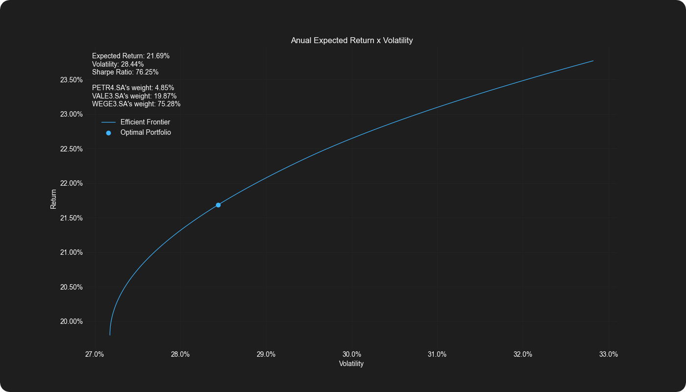
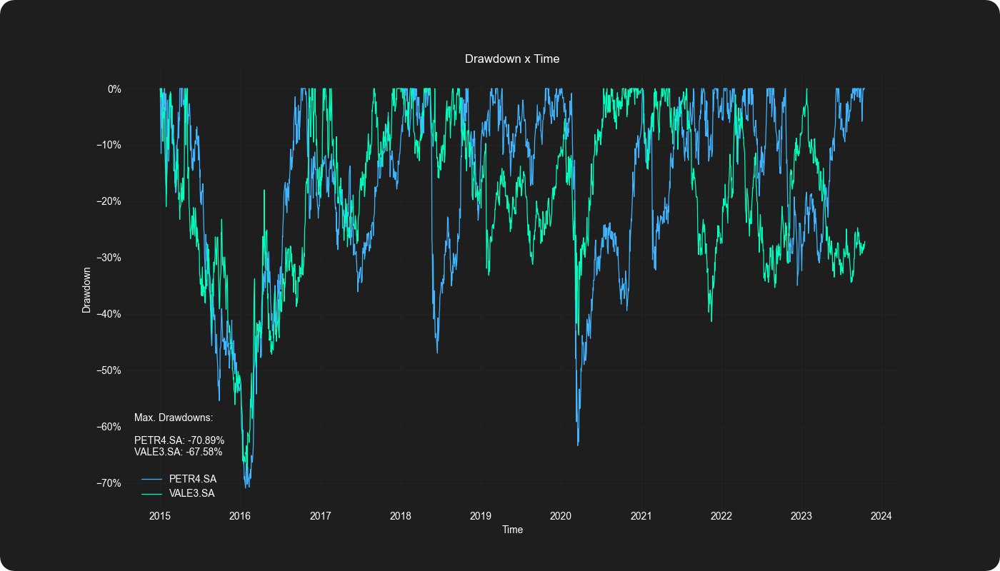

# 📈 Financial Market Python

Python programs tailored specifically for the world of financial markets, investment analysis, and trading. Whether you're a beginner or an experienced trader, you'll find a variety of tools and resources to help you in your financial endeavors.

## Getting Started

To use the programs in this repository, you'll need Python and a few Python libraries installed for each individual program. After having python installed you can install the required libraries as follows:

```
pip install library_name
```

### Running

Clone this repository to your local machine:

```
git clone https://github.com/gabrielpalassi/FinancialMarketPython.git
```

Navigate to the repository folder:

```
cd FinancialMarketPython
```

Now you're ready to use the programs!

```
python name-of-program.py
```

## Programs Overview

Here's an overview of the tools available in this repository (further explanations are available when running the programs):

### Markowitz Portfolio Optimization
Plot the efficient frontier and optimize a portfolio of stocks for highest sharpe ratio, highest return for a given risk or lowest risk for a given return.



### Drawdown Calculator
Plot the drawdown graph and find out the maximum drawdown of individual assets or a portfolio.



### Value at Risk (VaR) Calculator
Calculate the Value at Risk (VaR) of individual assets or a portfolio at different confidence levels.


### Brazilian Central Bank Historical Data
This program provides historical data from the Brazilian Central Bank. It allows users to access and analyze various economic and financial indicators (interest rates, inflation rates and exchange rates).


### Brazilian Central Bank Market Expectations Data
This program provides market expectations data gathered by the Brazilian Central Bank. It allows users to access and analyze various economic and financial indicators (interest rates, inflation rates and exchange rates).


### Last Month Performance Method Backtest
The Last Month Performance Method Backtest program is designed to evaluate the performance of an investment strategy based on the returns of assets in the last month. This model invests in IBOV if it outperformed CDI last month, and vice-versa.


### Moving Average Method Backtest
The Moving Average Method Backtest program is a tool for assessing the performance of an investment strategy that relies on a moving average. This model invests in IBOV if the previous month's closing value was higher than the moving average. In CDI if not.


## Contributing and Contact

We welcome contributions to this repository. If you have ideas for new programs, bug fixes, or improvements, please open an issue or submit a pull request.

If you have any questions, suggestions, or feedback, feel free to reach out to me at my [e-mail](mailto:gabrielpalassi@hotmail.com).
